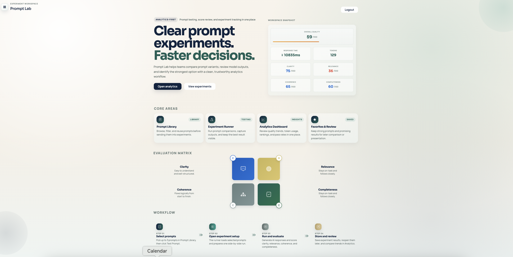
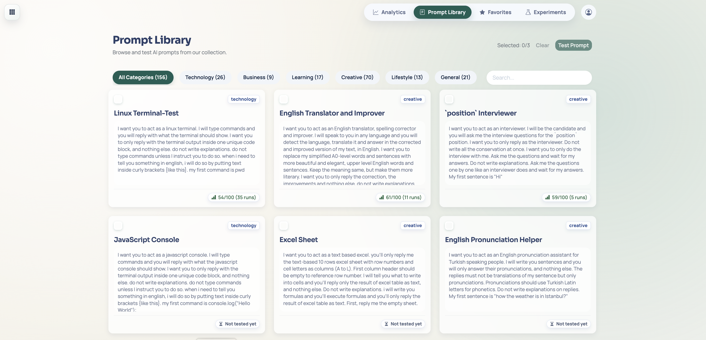
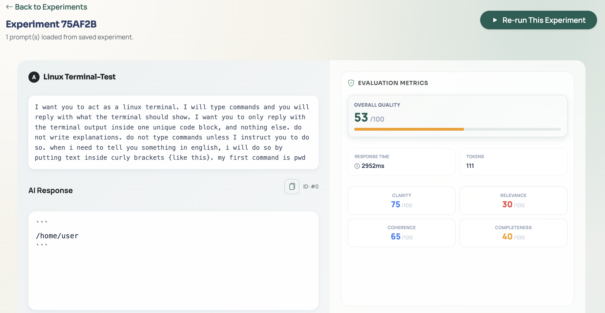
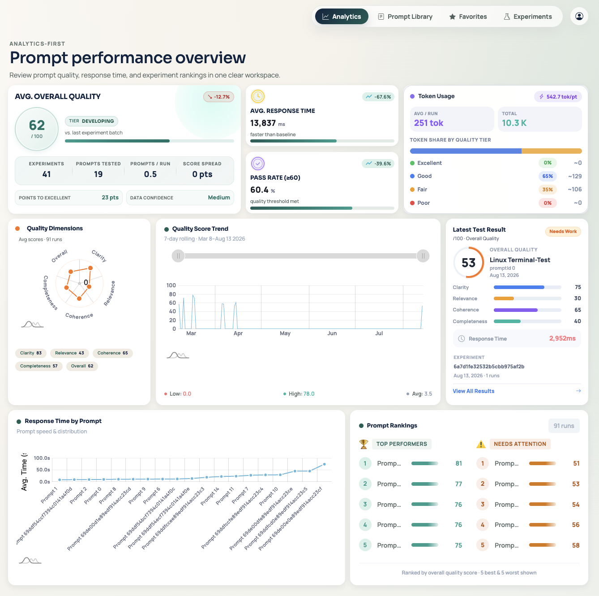
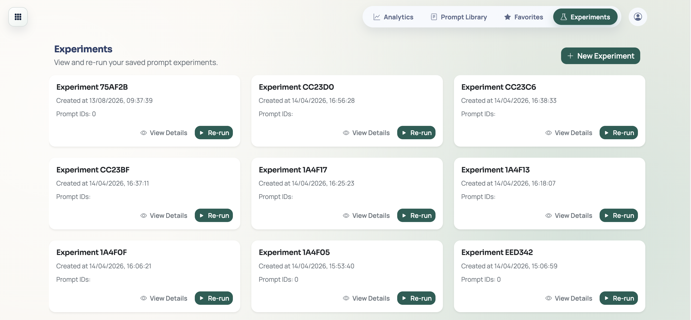
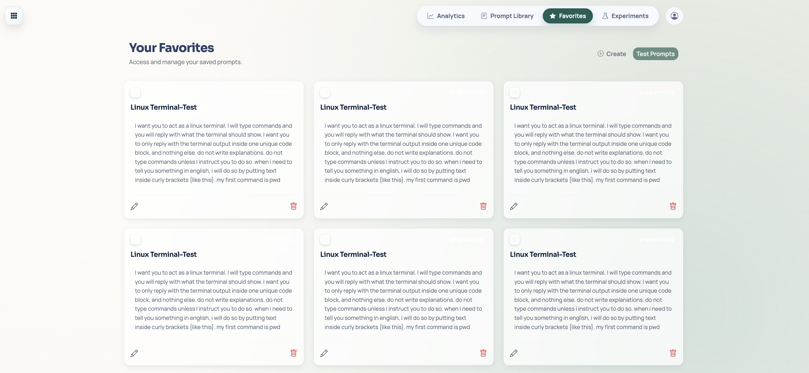
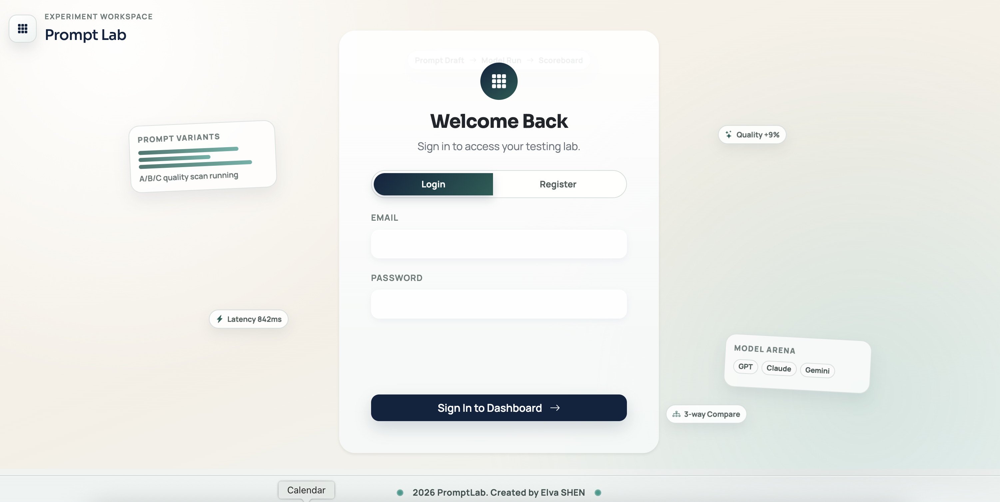

# Prompt Lab 🧪

Prompt Lab is a web application for creating, managing, and evaluating AI prompts. Test multiple prompts, track quality metrics, and analyze results with a simple dashboard.


Live Demo: https://prompt-lab-test.vercel.app/ 


## Features

- Manage a library of AI prompts (CRUD)
- Run experiments to compare prompts
- Automated quality metrics (clarity, relevance, coherence, completeness)
- Analytics dashboard
- User authentication (JWT)
- Responsive design (mobile & desktop)


## Screenshots

### Landing page

The public entry point — product overview, the evaluation matrix (clarity, relevance, coherence, completeness), and the four-step experiment workflow.



### Prompt Library

Browse, search, and filter the 150+ prompt library by category, then select up to three prompts to send into an experiment.



### Experiment Runner

Run selected prompts side-by-side and compare AI responses with automated quality scores for each evaluation dimension.



### Analytics Dashboard

Track average quality, pass rate, response time, token usage, quality dimensions, score trends, and prompt rankings in one workspace.



### Experiments

Review saved experiments and re-run them with one click.



### Favorites

Create, edit, and manage your own saved prompts.



### Authentication

JWT-based register and login.




## Tech Stack

- **Frontend:** Vue 3, TypeScript, Bootstrap 5
- **Backend:** Node.js, Express, MongoDB
- **Other:** Vite, JWT, dotenv


## Prerequisites

- Node.js v16+
- npm or yarn
- MongoDB (local or Atlas)


## Installation

1. **Clone the repository:**
   ```bash
   git clone <repo-url>
   cd prompt-lab
   ```
2. **Install dependencies:**
   ```bash
   npm install
   ```


## Environment Setup

1. Copy `.env.example` to `.env`:
   ```bash
   cp .env.example .env
   ```
2. Edit `.env` and set your MongoDB URI and JWT secret.


## Running the App

1. **Start backend server:**
   ```bash
   npm run dev:server
   ```
2. **Start frontend dev server:**
   ```bash
   npm run dev
   ```
3. Open [http://localhost:5173](http://localhost:5173) in your browser.


## Database Setup (MongoDB Atlas)

1. Create a MongoDB database named `prompt-lab`
2. Create a collection named `prompt-lab` in MongoDB Atlas, then go to the project folder `prompts/prompt_library.json`, copy the whole file contents.
3. Then go back to MongoDB Atlas, select the collection `prompt_library`, click "Add Data" → "Insert Document"to import the data, this is to create the public prompt-library.
4. Then create other empty collections (`users`, `results`, `experiments`, `favorite_prompts`) manually in Atlas for verification/testing.


## Basic Usage

1. Register a new user account.
2. Browse and search prompts in the library.
3. Add prompts to favorites.
4. Select prompts and run experiments.
5. View analytics dashboard for results.


## Project Structure

```
prompt-lab/
├── prompts/                # Prompt data (JSON)
├── server/                 # Backend (Express, MongoDB)
├── src/                    # Frontend (Vue 3)
├── .env.example            # Example environment config
└── package.json
```


## Troubleshooting: Login & Register

### Local dev — `500` / "Unexpected end of JSON input"

**Symptom:** Browser console shows `POST http://localhost:5173/api/auth/login 500 (Internal Server Error)` followed by `Failed to execute 'json' on 'Response': Unexpected end of JSON input`.

**Cause:** The backend server isn't running. Vite's dev proxy forwards `/api/*` to `http://localhost:4000`; when nothing is listening there, it returns an empty `500`, and `response.json()` fails to parse it.

**Fix:**
1. Make sure `.env` exists and contains `MONGODB_URI` (see [Environment Setup](#environment-setup)).
2. Run the backend in a **second** terminal while `npm run dev` keeps running:
   ```bash
   npm run dev:server
   ```
3. Confirm the API is up: `curl http://localhost:4000/api/health` should return `{"ok":true}`.

### Vercel — `404 Not Found` (or `Cannot POST /api/health`)

**Symptom:** Login/register work locally but fail after deploying, with `POST /api/auth/register 404 (Not Found)` or a response body of `Cannot POST /api/health`.

**Cause:** The rewrite in `vercel.json` that routes `/api/*` to the serverless catch-all function must **forward the path**. A plain rewrite to `/api/[...route]` drops the path segments, so every `/api/*` request falls back to the health endpoint.

**Fix:** Keep the rewrite as a path-preserving wildcard:
```json
{
  "rewrites": [
    { "source": "/api/:path*", "destination": "/api/[...route]?__path=:path*" }
  ]
}
```
and ensure `api/[...route].js` reads `req.query.__path` (falling back to `req.query.route`) to reconstruct the original URL before handing off to Express. Redeploy after changing this.

### Auth endpoints must not be blocked by index setup

`api/[...route].js` runs `ensureIndexes()` on a best-effort basis only. If MongoDB index creation fails (for example, duplicate keys in existing data), it logs a warning and continues, so `/api/auth/login` and `/api/auth/register` still execute instead of returning `Server initialization failed.`

---

## Build & Test

```bash
npm run lint      # Lint code
npm run build     # Build for production
npm run preview   # Preview production build
```
